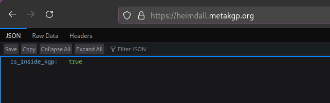
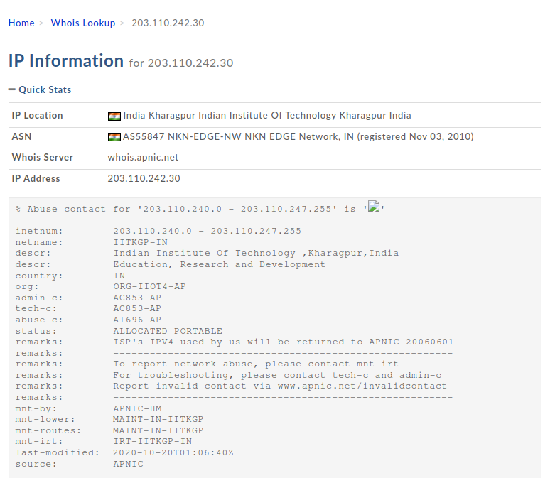

<div id="top"></div>

<!-- PROJECT SHIELDS -->
<!-- https://www.markdownguide.org/basic-syntax/#reference-style-links-->
<div align="center">

[![Contributors][contributors-shield]][contributors-url]
[![Forks][forks-shield]][forks-url]
[![Stargazers][stars-shield]][stars-url]
[![Issues][issues-shield]][issues-url]
[![MIT License][license-shield]][license-url]
[![Wiki][wiki-shield]][wiki-url]

</div>

<!-- PROJECT LOGO -->
<br />
<!-- UPDATE -->
<div align="center">
  <a href="https://github.com/metakgp/heimdall">
    
  </a>

  <h3 align="center">Heimdall</h3>

  <p align="center">
  <!-- UPDATE -->
    <i>The network checker for IIT KGP</i>
    <br />
    <a href="https://github.com/metakgp/heimdall/issues">Report Bug</a>
    ·
    <a href="https://github.com/metakgp/heimdall/issues">Request Feature</a>
  </p>
</div>

<!-- TABLE OF CONTENTS -->
<details>
<summary>Table of Contents</summary>

- [About The Project](#about-the-project)
  - [Supports](#supports)
- [Getting Started](#getting-started)
  - [Prerequisites](#prerequisites)
  - [Installation](#installation)
- [Usage](#usage)
- [Maintainer(s)](#maintainers)
- [Contact](#contact)
- [Additional documentation](#additional-documentation)

</details>

<!-- ABOUT THE PROJECT -->

## About The Project

<!-- UPDATE -->
<div align="center">
  <a href="https://github.com/metakgp/heimdall">
    
  </a>
</div>

_Heimdall checks the client's IP to know whether the request has originated from inside the IIT Kharagpur network and verifies their institute email ID. This helps to ascertain if the client is a current member of the institute and should have access to certain information._

<p align="right">(<a href="#top">back to top</a>)</p>

<div id="supports"></div>

### Supports:

<!-- UPDATE -->

1. Shells
   - `bash`
   - `zsh`
2. OS(s)
   - any `*nix`[`GNU+Linux` and `Unix`]

<p align="right">(<a href="#top">back to top</a>)</p>

## Getting Started

To set up a local instance of the application, follow the steps below.

### Prerequisites

The following dependencies are required to be installed for the project to function properly:

<!-- UPDATE -->

- [go](https://go.dev/)
- [nodejs](https://nodejs.org/en/download/package-manager)

To create credentials.json file, create the [OAuth consent screen](https://developers.google.com/workspace/guides/configure-oauth-consent#configure_oauth_consent) and then create [OAuth client ID credentials](https://developers.google.com/workspace/guides/create-credentials#oauth-client-id) by following the steps provided there. While creating OAuth client ID credentials, set redirect URL to any port of the localhost. Then save downloaded json file as credentials.json in the project's root folder.

Then enable [Gmail API](https://console.cloud.google.com/apis/library/gmail.googleapis.com) to enable receiving OTP.
   

<p align="right">(<a href="#top">back to top</a>)</p>

### Installation

_Now that the environment has been set up and configured to properly compile and run the project, the next step is to install and configure the project locally on your system._

<!-- UPDATE -->

1. Clone the repository
   ```sh
   git clone https://github.com/metakgp/heimdall.git
   ```
2. Configure environment variables
   ```sh
   cd ./heimdall
   cp .env.template .env
   ```
   Choose a strong JWT_SECRET_KEY and edit the .env file accordingly.

3. Install go dependencies
   ```sh
   go mod download
   ```
4. Compile the code
   ```sh
   go build
   ```
5. Install node modules
   ```sh
   cd frontend
   npm install
   ```
   It is suggested to use pnpm as package manager due to its efficiency. To use pnpm, run following commands instead of above:
   ```sh
   npm install -g pnpm
   cd frontend
   pnpm install
   ```

6. Start development server
   ```sh
   npm run dev
   cd ..
   ```
7. Execute the script
   ```sh
   ./heimdall
   ```

When prompted to enter authorization code, visit the link provided in terminal which will redirect to localhost. Then inspect the url after redirection and copy the string after `code=` and paste it in the terminal. This will create `token.json` file. You need to create this token only once and it will be valid for 6 months.

<p align="right">(<a href="#top">back to top</a>)</p>

### How to use?

Enter your institute mail id in the box provided on screen. You will receive an OTP if the provided mail id is a valid institute mail id. In that case, enter the OTP received at the provided email address and verify. These verifies that you are a current member of the institute.

Next, you will have access to services like [Naarad](https://github.com/metakgp/naarad) and [Chillzone](https://github.com/metakgp/chillzone) which are available only for KGPians. These can be accessed via the campus network.

<p align="right">(<a href="#top">back to top</a>)</p>

<!-- BACKGROUND INFORMATION -->

## How does this work?

<!-- UPDATE -->

IIT Kharagpur has its internal campus network which is the primary source of Internet for its students, staff and faculty.

For connection to the outside network (normal internet services), it uses a [NAT Gateway](https://docs.aws.amazon.com/vpc/latest/userguide/vpc-nat-gateway.html) which handles all requests going outside. While doing so, the client IP address in those requests is changed from the internal IP to any one of the pool of public IP addresses assigned to IIT Kharagpur.

So, to check whether a request has originated from inside the IIT Kharagpur network, we just check whether the client's IP address belongs to one of those public IPs.

While just doing this would have sufficed, we do not know whether these Public IPs are permanent or are subject to change over time. We therefore do a Whois lookup of the IP address and check its response to decide whether this IP address belongs to IIT Kharagpur. A screenshot of such a Whois lookup is shown below.

<div align="center">
  <a href="https://github.com/metakgp/heimdall">
    
  </a>

  _For complete Whois information check [here](https://whois.domaintools.com/203.110.242.30)._
</div>

<p align="right">(<a href="#top">back to top</a>)</p>

All this time you might be wondering why you need a different server to just check this. Can't we do this in any project where such a feature is required?

Well yes. Provided it has a backend server. This cannot be done in the front-end because the Web Browser does not provide the IP information to the Javascript engine. So for projects that do not need a backend, like [Chillzone](https://github.com/metakgp/chillzone) or [ERP Auto Login](https://github.com/metakgp/iitkgp-erp-auto-login), this simple API call can do the required work.

## Maintainer(s)

<!-- UPDATE -->

- [Chirag Ghosh](https://github.com/chirag-ghosh)

<p align="right">(<a href="#top">back to top</a>)</p>

## Contact

<p>
📫 Metakgp -
<a href="https://bit.ly/metakgp-slack">
  
</a>
<a href="mailto:metakgp@gmail.com">
  
</a>
<a href="https://www.facebook.com/metakgp">
  
</a>
<a href="https://www.linkedin.com/company/metakgp-org/">
  
</a>
<a href="https://twitter.com/metakgp">
  
</a>
<a href="https://www.instagram.com/metakgp_/">
  
</a>
</p>

<p align="right">(<a href="#top">back to top</a>)</p>

## Additional documentation

- [License](/LICENSE)
- [Code of Conduct](/.github/CODE_OF_CONDUCT.md)
- [Security Policy](/.github/SECURITY.md)
- [Contribution Guidelines](/.github/CONTRIBUTING.md)

<p align="right">(<a href="#top">back to top</a>)</p>

<!-- MARKDOWN LINKS & IMAGES -->

[contributors-shield]: https://img.shields.io/github/contributors/metakgp/heimdall.svg?style=for-the-badge
[contributors-url]: https://github.com/metakgp/heimdall/graphs/contributors
[forks-shield]: https://img.shields.io/github/forks/metakgp/heimdall.svg?style=for-the-badge
[forks-url]: https://github.com/metakgp/heimdall/network/members
[stars-shield]: https://img.shields.io/github/stars/metakgp/heimdall.svg?style=for-the-badge
[stars-url]: https://github.com/metakgp/heimdall/stargazers
[issues-shield]: https://img.shields.io/github/issues/metakgp/heimdall.svg?style=for-the-badge
[issues-url]: https://github.com/metakgp/heimdall/issues
[license-shield]: https://img.shields.io/github/license/metakgp/heimdall.svg?style=for-the-badge
[license-url]: https://github.com/metakgp/heimdall/blob/master/LICENSE
[wiki-shield]: https://custom-icon-badges.demolab.com/badge/metakgp_wiki-grey?logo=metakgp_logo&style=for-the-badge
[wiki-url]: https://wiki.metakgp.org
